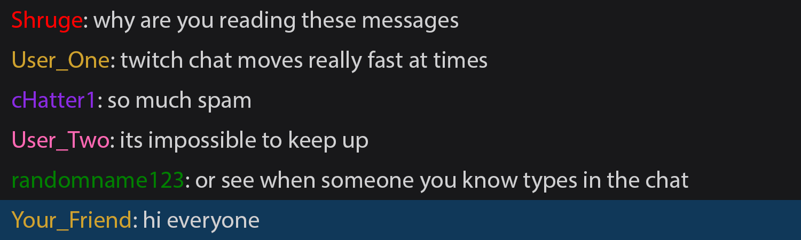

# twitch-friends

Friend-like system for twitch chat  
Highlight messages from your friends to more easily notice their messages  

Add custom highlights for any users you like  
Message styling done by applying css styles to messages of specified users  

## Showcase

Adding a simple blue background instantly makes the message from your friend stand out  
Much easier to spot when they are typing!  

  

### Unique highlights for different people

Did you notice the message from your other friend?  
Here it is again with a different, much brighter, style applied  

  
